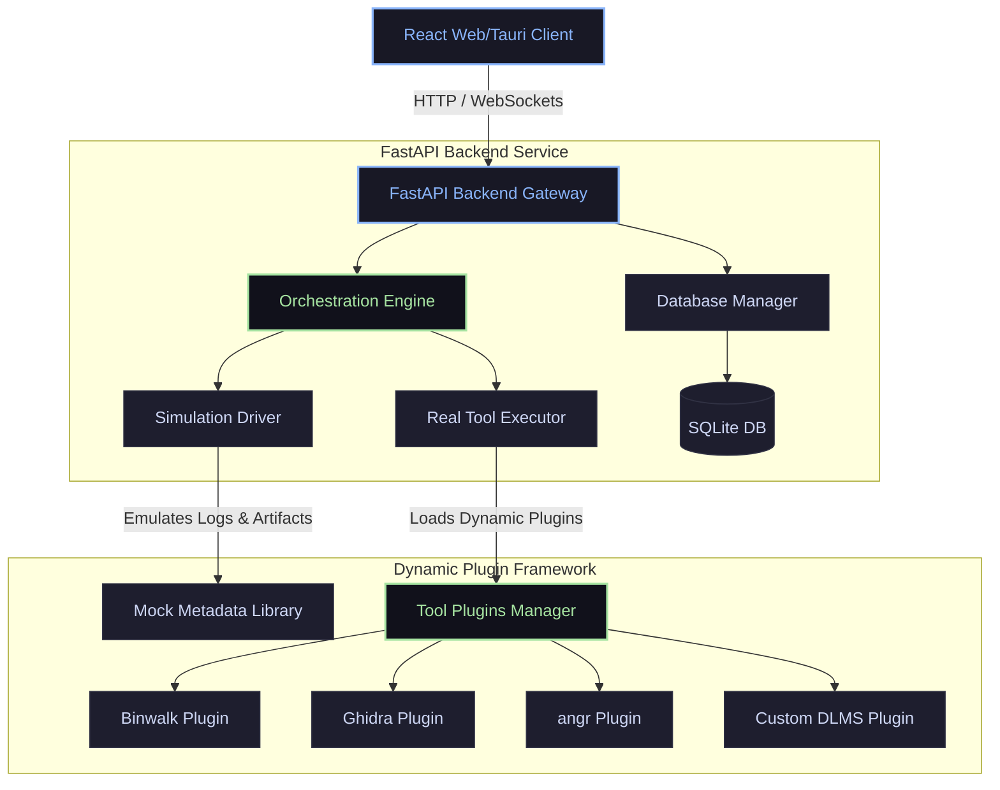
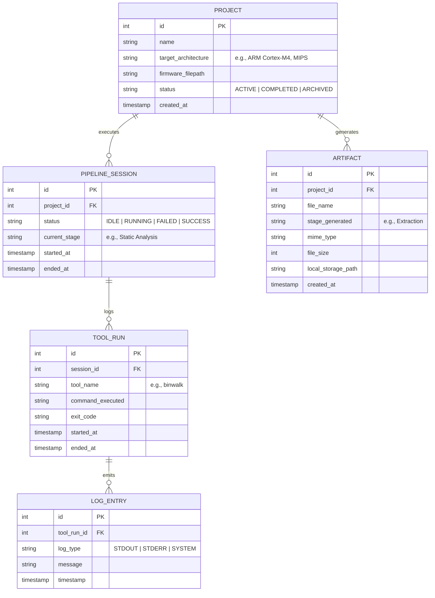

# Software Architecture Design: Firmware Analysis Workflow Simulator (FAWS)

This document presents the complete software architecture, technical design, and implementation roadmap for the **Firmware Analysis Workflow Simulator (FAWS)**. Designed as a Digital Twin of a firmware analysis pipeline for DLMS/COSEM Smart Meters, FAWS serves as an interactive learning platform, cybersecurity dashboard, and execution orchestrator.

---

## 1. Executive Summary & Vision

FAWS is designed as a **Digital Twin** of a firmware analysis pipeline. In the initial phase, it acts as an **interactive simulator** to educate students, researchers, and new interns on firmware analysis concepts. In later phases, it is designed to evolve into a **production-grade automation platform** that runs real security tools (Binwalk, Ghidra, angr, AFL++, etc.) against smart meter firmware.

### Core Architectural Directives
- **Separation of Concerns**: Decouple the user interface (UI) from the execution layer (Simulator vs. Real Execution).
- **Extensible Plugin System**: Every security tool is a self-contained plugin conforming to a strict interface.
- **Bi-directional Data Flow**: Emulate the outputs of one stage becoming the inputs of another, creating a structured dependencies chain.
- **Cybersecurity Aesthetic**: Dark, high-contrast, data-dense, dashboard-focused layout with neon status accents.

---

## 2. Technology Stack Selection

To satisfy the dual requirements of a beautiful desktop dashboard and local system access (to execute CLI tools), the following tech stack is recommended:

| Layer | Technology | Rationale |
| :--- | :--- | :--- |
| **Frontend Framework** | **React.js + TypeScript + Vite** | High performance, strict typing, rich ecosystem, component-driven development. |
| **Desktop Wrapper (Optional)** | **Tauri or Electron** | Facilitates direct native filesystem access and shell execution for CLI tools if running as a desktop app. |
| **Backend API Gateway** | **Python (FastAPI + Pydantic)** | Python is the standard language for binary analysis scripts (angr, binwalk APIs). FastAPI offers asynchronous capability, speed, and auto-generated OpenAPI documentation. |
| **Interactive Pipeline** | **React Flow** | Visual node-based interface to build, display, and interact with the firmware pipeline stages. |
| **UI Styling** | **Vanilla CSS Modules** | Ensures clean isolation of styles and strict compliance with custom styling rules, preventing class collision. |
| **Database Store** | **SQLite (via SQLAlchemy/Alembic)** | Lightweight, serverless relational database. Stores local project states, log outputs, learning stats, and config. |
| **Data Visualization** | **Recharts** | Rendering statistics on firmware entropy, vulnerability counts, and timeline completion. |

---

## 3. High-Level System Architecture

The architecture is split into three main layers: **Presentation Layer**, **Orchestration & Simulation Engine**, and the **Plugin Integration Layer**.



### Architectural Subsystems
1. **Presentation Layer (Frontend)**:
   - Contains the **Dashboard**, **Interactive Pipeline Canvas**, **Tool Explorer**, and **AI Assistant Panel**.
   - Communicates with the backend using REST APIs for structural data and WebSockets for real-time streaming of logs and pipeline execution states.
2. **Orchestration & Simulation Engine (Backend Core)**:
   - Coordinates the transitions between pipeline stages.
   - Manages state machine transitions (`IDLE` -> `RUNNING` -> `COMPLETED` / `FAILED`).
   - Translates inputs from Stage $N-1$ into inputs for Stage $N$.
3. **Plugin Integration Layer (Extensible Layer)**:
   - Provides a common base class (`BaseToolPlugin`) defining how CLI commands are constructed, inputs validated, outputs parsed, and errors handled.

---

## 4. Module & Component Hierarchies

### Module Hierarchy (Functional Boundaries)
```
FAWS Backend Modules
├── API Service (Endpoints for projects, pipeline control, KB)
├── Database Model (ORM schemas, migrations)
├── Pipeline Orchestrator (State machine, stage dependencies, data flow router)
├── Simulation Engine (Pre-baked execution runs, entropy/artifact generators)
└── Plugin Loader (Discovers and executes python plugins for external CLI tools)

FAWS Frontend Modules
├── Dashboard & Workspace (Project overview, vulnerability counters, reports)
├── Pipeline Canvas (Interactive node representation, controls, active data flows)
├── Tool Explorer (Deep-dive documentation, command editor, visual run state)
├── Knowledge Base & Learning Platform (DLMS/COSEM standards, security baselines)
├── Project Timeline & Tracker (Task checklist, artifact catalog)
└── AI Explanation Panel (Context-aware tool commands & disassembly explainer)
```

### UI Component Hierarchy (React)
```
App.tsx
├── Layout (Sidebar + Main Panel + Top Header)
│   ├── TopHeader (Workspace Status, Active Project Selector, Global Search)
│   ├── Sidebar (Navigation links, quick-metrics, logs-dock widget)
│   └── Viewport (Dynamic Route Container)
│       ├── DashboardView
│       │   ├── MetricCardsGrid (Entropy, risk score, discovered secrets)
│       │   ├── ProjectActivityChart (Chronological timeline progress)
│       │   └── DeliverablesList (Security checklist status)
│       ├── PipelineCanvasView
│       │   ├── ControlBar (Run pipeline, step-over, pause, stop)
│       │   ├── ReactFlowCanvas (Node graph representing pipeline stages)
│       │   │   └── CustomPipelineNode (Shows status: idle, active, success, error)
│       │   └── OutputDock (Real-time logs + generated artifacts drawer)
│       ├── ToolExplorerView
│       │   ├── ToolSidebar (List of categories: Extraction, Static, Dynamic...)
│       │   └── ToolDetailsPanel
│       │       ├── ToolTabs (Overview, Internal Logic, Commands, Troubleshooting)
│       │       └── CommandRunnerConsole (Interactive simulator for commands)
│       ├── KnowledgeBaseView
│       │   ├── CategoryBrowser (DLMS, Smart Grid Security, Common Exploits)
│       │   └── ArticleViewer (Markdown renderer with syntax highlighter)
│       └── LogsMonitorView
│           ├── SystemConsole (Standard output/error stream)
│           └── ArtifactGraph (Lineage tracking of files)
└── GlobalPanels
    ├── AIExplanationDrawer (Slides out from right; displays context-sensitive explanations)
    └── SettingsModal (Toggle Simulator vs. Real Mode, configure local executable paths)
```

---

## 5. File & Folder Directory Structure

```
firmware-analysis-simulator/
├── backend/
│   ├── app/
│   │   ├── __init__.py
│   │   ├── main.py                 # FastAPI application startup & routing
│   │   ├── config.py               # Global settings (simulator vs. real mode, paths)
│   │   ├── database.py             # SQLAlchemy configuration and session factory
│   │   ├── models/                 # SQLAlchemy DB models
│   │   │   ├── __init__.py
│   │   │   ├── project.py
│   │   │   ├── session.py
│   │   │   ├── tool_run.py
│   │   │   └── kb.py
│   │   ├── schemas/                # Pydantic schemas (request/response validation)
│   │   │   ├── project.py
│   │   │   ├── session.py
│   │   │   └── tool_run.py
│   │   ├── core/                   # Pipeline execution logic
│   │   │   ├── orchestrator.py     # Main state machine coordinator
│   │   │   └── simulator.py        # Generates mock stdout, logs and results
│   │   ├── plugins/                # Sub-system for tools integration
│   │   │   ├── __init__.py
│   │   │   ├── base.py             # Base class (BaseToolPlugin)
│   │   │   ├── manager.py          # Dynamic imports & register of plugins
│   │   │   ├── binwalk.py          # Implementation of Binwalk plugin
│   │   │   ├── ghidra.py           # Implementation of Ghidra headless runner
│   │   │   └── angr.py             # Implementation of angr symbol executor
│   │   └── routes/                 # FastAPI router modules
│   │       ├── projects.py
│   │       ├── pipeline.py
│   │       ├── tools.py
│   │       └── knowledge.py
│   ├── tests/                      # Pytest test suites
│   ├── requirements.txt
│   └── alembic.ini                 # DB migrations config
│
├── frontend/
│   ├── public/
│   ├── src/
│   │   ├── assets/                 # SVGs, raw illustrations, font files
│   │   ├── components/             # Reusable UI components
│   │   │   ├── common/             # Buttons, cards, spinners, tooltips
│   │   │   ├── dashboard/          # Metric card, activity chart components
│   │   │   ├── pipeline/           # React Flow custom nodes, edges, and control controls
│   │   │   ├── explorer/           # Console terminal, tool detail tabs
│   │   │   └── ai/                 # AI prompt panel, message lists
│   │   ├── hooks/                  # Custom React hooks (e.g. useWebSocket, usePipeline)
│   │   ├── pages/                  # Page containers mapped to routes
│   │   │   ├── Dashboard.tsx
│   │   │   ├── Pipeline.tsx
│   │   │   ├── ToolExplorer.tsx
│   │   │   ├── KnowledgeBase.tsx
│   │   │   ├── Deliverables.tsx
│   │   │   └── Logs.tsx
│   │   ├── router/                 # React Router routing configuration
│   │   ├── store/                  # Zustand store modules
│   │   │   ├── projectStore.ts
│   │   │   ├── pipelineStore.ts
│   │   │   └── uiStore.ts
│   │   ├── styles/                 # Styling tokens & global variables
│   │   │   ├── variables.css
│   │   │   └── main.css
│   │   ├── utils/                  # Helper utilities (formatters, parser)
│   │   ├── App.tsx
│   │   ├── main.tsx
│   │   └── types.ts                # TypeScript common interfaces
│   ├── package.json
│   ├── vite.config.ts
│   └── tsconfig.json
│
├── docs/                           # Learning materials & architecture drawings
│   └── dlms_cosem_reference.md     # Reference specifications
└── README.md
```

---

## 6. Routing Structure

### Frontend Routes (React Router SPA)
- `/` -> Redirects to `/dashboard`
- `/dashboard` -> Core stats, active project overview, deliverable completion state, timelines.
- `/pipeline` -> Interactive pipeline canvas (React Flow diagram representing stages).
- `/explorer` -> Tool explorer list. Clicking a tool shows:
  - `/explorer/:toolId` -> Displays details (Purpose, Input/Output, Troubleshooting, Sandbox Command Console).
- `/kb` -> Knowledge Base database index.
  - `/kb/:articleId` -> Markdown reader for targeted learning on smart meter protocols, crypto bugs, etc.
- `/deliverables` -> Project management dashboard showing files generated, target checklists, and sign-offs.
- `/logs` -> Unified system logs viewer with filterable categories (Stdout, Stderr, System notifications).
- `/settings` -> Core toggle (Simulation Mode vs. Real Mode), local path configurations, and developer overrides.

### Backend REST API Endpoints

#### Projects Management
- `GET /api/projects` -> List all active firmware analysis projects.
- `POST /api/projects` -> Create a new firmware analysis profile (sets target metadata, chip architecture).
- `GET /api/projects/{id}` -> Get detailed metrics and pipeline state for a project.

#### Pipeline Execution
- `GET /api/projects/{id}/pipeline` -> Get the graph nodes, edges, states, and data flow linkages.
- `POST /api/projects/{id}/pipeline/run` -> Kick off the analysis workflow (simulated or real).
- `POST /api/projects/{id}/pipeline/step` -> Execute the next stage sequentially.
- `POST /api/projects/{id}/pipeline/stop` -> Halt execution and clean up outputs.

#### Tool Core & Plugins
- `GET /api/tools` -> Query all registered plugins and their details (commands, inputs, parameters).
- `POST /api/tools/{tool_id}/run` -> Run a tool standalone in sandbox mode with custom arguments.
- `GET /api/tools/{tool_id}/runs` -> Retrieve execution logs history.

#### Knowledge & Docs
- `GET /api/kb/articles` -> Get list of categorized tutorial and reference documents.
- `GET /api/kb/articles/{id}` -> Fetch markdown document content.

---

## 7. Relational Database Schema

Below is the entity-relationship definition (modeled for SQLite) to track local projects, simulated analysis states, and learning modules.



---

## 8. Plugin Architecture for Tool Integration

To ensure the platform can seamlessly switch from simulation to running real binary analysis CLI programs without rewriting the dashboard or the core orchestration, the backend relies on an abstract plugin framework.

### The Unified Interface (`BaseToolPlugin`)

Every tool integration implements the following contract in Python:

```python
# backend/app/plugins/base.py
from abc import ABC, abstractmethod
from typing import Dict, Any, List

class ToolInput:
    def __init__(self, target_filepath: str, extra_args: Dict[str, Any]):
        self.target_filepath = target_filepath  # File to process (e.g. flash.bin)
        self.extra_args = extra_args            # Parameters (e.g., --entropy, -v)

class ToolOutput:
    def __init__(self, success: bool, exit_code: int, logs: List[str], generated_files: List[str], parsed_metrics: Dict[str, Any]):
        self.success = success                  # Status outcome
        self.exit_code = exit_code              # Execution exit code
        self.logs = logs                        # Combined stdout and stderr
        self.generated_files = generated_files  # Output file paths
        self.parsed_metrics = parsed_metrics    # Extracted data (e.g., keys found, sections identified)

class BaseToolPlugin(ABC):
    @property
    @abstractmethod
    def name(self) -> str:
        """Unique identifier of the tool (e.g., 'binwalk', 'ghidra')"""
        pass

    @property
    @abstractmethod
    def documentation(self) -> Dict[str, Any]:
        """Returns structured helper info: purpose, commands, common errors, troubleshooting."""
        pass

    @abstractmethod
    def validate_inputs(self, tool_input: ToolInput) -> bool:
        """Verifies if the target file exists and is of correct type."""
        pass

    @abstractmethod
    async def execute_real(self, tool_input: ToolInput) -> ToolOutput:
        """Performs actual command-line subprocess execution on the local host."""
        pass

    @abstractmethod
    async def execute_simulated(self, tool_input: ToolInput) -> ToolOutput:
        """Returns pre-recorded execution traces, emulated output logs, and realistic metrics."""
        pass
```

### Dynamic Integration Factory

The `PluginManager` loads these modules dynamically and routes execution based on the global configuration:

```python
# backend/app/plugins/manager.py
import importlib
import os
from typing import Dict
from app.plugins.base import BaseToolPlugin

class PluginManager:
    def __init__(self):
        self.plugins: Dict[str, BaseToolPlugin] = {}
        self.load_plugins()

    def load_plugins(self):
        plugin_dir = os.path.dirname(__file__)
        for file in os.listdir(plugin_dir):
            if file.endswith('.py') and file not in ('__init__.py', 'base.py', 'manager.py'):
                module_name = f"app.plugins.{file[:-3]}"
                module = importlib.import_module(module_name)
                # Find all classes that inherit from BaseToolPlugin and instantiate them
                for attr_name in dir(module):
                    attr = getattr(module, attr_name)
                    if isinstance(attr, type) and issubclass(attr, BaseToolPlugin) and attr is not BaseToolPlugin:
                        plugin_instance = attr()
                        self.plugins[plugin_instance.name] = plugin_instance

    def execute_tool(self, tool_name: str, tool_input: ToolInput, mode: str = "simulation") -> ToolOutput:
        plugin = self.plugins.get(tool_name)
        if not plugin:
            raise ValueError(f"Plugin '{tool_name}' is not registered.")
        
        if not plugin.validate_inputs(tool_input):
            raise ValueError("Input validation failed.")
            
        if mode == "real":
            return plugin.execute_real(tool_input)
        else:
            return plugin.execute_simulated(tool_input)
```

---

## 9. Data Flow Between Pipeline Stages

Data flows dynamically between stages. The output of one stage generates artifacts that are automatically passed as inputs to the next block in the graph.

```
+-------------------------------------------------------------------------------------------------+
|                                    PIPELINE ORCHESTRATOR                                        |
+-------------------------------------------------------------------------------------------------+
|                                                                                                 |
|  [Firmware Binary] ---> [Identification (Strings/File)]                                         |
|                                     |                                                           |
|                                     +---> File Signature / CPU architecture metadata            |
|                                     v                                                           |
|                        [Extraction (Binwalk)]                                                   |
|                                     |                                                           |
|                                     +---> Root File System / Kernel images / SquashFS folder    |
|                                     v                                                           |
|                        [Static Analysis (Cutter/Strings)]                                       |
|                                     |                                                           |
|                                     +---> Imported Symbols, Function Signatures, Call Graphs    |
|                                     v                                                           |
|                        [Reverse Engineering (Ghidra Headless)]                                  |
|                                     |                                                           |
|                                     +---> Decompiled C-code / Assembly / DLMS parsing routines  |
|                                     v                                                           |
|                        [Secret Detection (TruffleHog/Custom Regex)]                             |
|                                     |                                                           |
|                                     +---> Found Hardcoded DLMS Keys, API tokens, Certificates   |
|                                     v                                                           |
|                        [Protocol Analysis (Wireshark/Gurux DLMS)]                               |
|                                     |                                                           |
|                                     +---> DLMS APDUs, AARQ/AARE handshake logs, packet traces   |
|                                     v                                                           |
|                        [Fuzzing & Symbolic Execution (angr/AFL++)]                              |
|                                     |                                                           |
|                                     +---> Discovered Crashes, Memory Corruptions, Exploit Paths |
|                                     v                                                           |
|                        [Risk Assessment & Reporting]                                            |
|                                     |                                                           |
|                                     +---> Completed Security Audit PDF / Remediation Plan       |
|                                                                                                 |
+-------------------------------------------------------------------------------------------------+
```

---

## 10. Design System & UI/UX Guidelines

FAWS must look like a high-end cybersecurity platform (analogous to Datadog, Snyk, or Carbon Black) with clear learning tools.

### Design Tokens & Theme (Vanilla CSS Variables)

```css
/* frontend/src/styles/variables.css */
:root {
  /* Color Palette (Deep Space Cyber Theme) */
  --bg-primary: #0a0a0f;       /* Abyssal Black: primary app background */
  --bg-secondary: #12121e;     /* Obsidian Gray: cards and panels */
  --bg-tertiary: #1a1a2b;      /* Dark Slate: borders, fields, hover backdrops */
  
  --text-primary: #f1f1f6;     /* Off-White: content text */
  --text-secondary: #8c8c9e;   /* Muted Slate: secondary and system metadata */
  --text-code: #00ff66;        /* Matrix Green: console code output */

  /* Accents & Status Indicators */
  --accent-cyan: #00e5ff;      /* Cyan Neon: active tabs, main visual focus */
  --accent-purple: #9d4edd;    /* Purple Neon: highlights and secondary metrics */
  
  --status-idle: #8c8c9e;      /* Muted Gray: idle/unstarted state */
  --status-running: #00e5ff;   /* Flashing Cyan: actively running tool */
  --status-success: #00e676;   /* Electric Green: compilation/analysis pass */
  --status-warning: #ffd600;   /* Warning Amber: non-breaking findings (e.g. weak crypt) */
  --status-error: #ff1744;     /* Crimson Red: crash detected, command failure */

  /* Typography */
  --font-sans: 'Outfit', 'Inter', system-ui, sans-serif;
  --font-mono: 'JetBrains Mono', 'Fira Code', monospace;

  /* Layout Constants */
  --sidebar-width: 260px;
  --border-radius-sm: 4px;
  --border-radius-md: 8px;
  --border-radius-lg: 12px;
  --shadow-neon: 0 0 12px rgba(0, 229, 255, 0.2);
}
```

### Core UX Rules
1. **Interactive Sandbox Terminals**:
   - The "Commands" tab in the Tool Explorer should contain a mock console.
   - Users must be able to type commands (e.g., `binwalk -e flash.bin`) and press Enter to see the terminal execute the instruction (in simulation mode, it prints realistic mock stdout logs with typewriter animations).
2. **Visual Hierarchy & State Consistency**:
   - A tool node on the Pipeline canvas must flash when executing (`--status-running`), glow green on success (`--status-success`), and turn red with an alert icon on error (`--status-error`).
3. **No Placeholders**:
   - All tools must feature complete documentation, simulated command execution outputs, and descriptive log structures.
4. **Context-Aware Assistance (AI Panel)**:
   - When a user selects a node (e.g., "Symbolic Execution") or encounters a simulated CLI error, the slide-out AI Explanation panel must immediately update to offer detailed security breakdowns, explain DLMS registers (e.g., OBIS codes), or troubleshoot command inputs.

---

## 11. State Management Pattern

We decouple local UI layout state from global simulation state using **Zustand** (lightweight state containers) and cache API data query results using **React Query**.

```typescript
// frontend/src/store/pipelineStore.ts
import { create } from 'zustand';

export interface PipelineStage {
  id: string;
  name: string;
  status: 'idle' | 'running' | 'success' | 'warning' | 'failed';
  currentTool: string;
  outputArtifacts: string[];
}

interface PipelineState {
  stages: PipelineStage[];
  activeSessionId: string | null;
  isRunning: boolean;
  activeStageIndex: number;
  
  // Actions
  initializeSession: (projectId: string) => void;
  startPipeline: () => Promise<void>;
  stepNext: () => Promise<void>;
  stopPipeline: () => void;
  updateStageStatus: (stageId: string, status: PipelineStage['status']) => void;
}

export const usePipelineStore = create<PipelineState>((set, get) => ({
  stages: [],
  activeSessionId: null,
  isRunning: false,
  activeStageIndex: 0,
  
  initializeSession: (projectId) => {
    // Queries endpoints to fetch stages metadata for the current project
  },
  
  startPipeline: async () => {
    set({ isRunning: true });
    // Triggers FastAPI backend POST /api/projects/:id/pipeline/run
  },
  
  stepNext: async () => {
    // Increments activeStageIndex and runs the target tool sequence
  },
  
  stopPipeline: () => {
    set({ isRunning: false });
    // Cleanups active run state
  },
  
  updateStageStatus: (stageId, status) => {
    set((state) => ({
      stages: state.stages.map((stage) =>
        stage.id === stageId ? { ...stage, status } : stage
      ),
    }));
  },
}));
```

---

## 12. Security & Command Sandboxing (Real Mode Execution)

When the application transitions from **Simulation Mode** to **Real Mode**, it executes binary-level analysis commands on the host machine. To prevent OS vulnerabilities, command injection, and host contamination, the dynamic plugin engine implements strict sandboxing:

1. **Subprocess Sanitization**:
   - Never run commands inside a subshell using `shell=True` in Python subprocess calls. Use argument arrays (`['binwalk', '-e', target_path]`) to prevent command injection characters (`&&`, `;`, `|`).
2. **Path Containment (Chroot / Absolute Directory Jail)**:
   - File reads/writes must be explicitly jailed under the project's artifact directory:
     `c:\Users\akars\OneDrive\Desktop\Firmware Analysis workflow simulator\data\projects\<id>\workspace\`.
   - Before executing code, path traversals (e.g., paths containing `../`) must be intercepted and rejected.
3. **Execution Timeouts**:
   - Decompilation processes (Ghidra headless runs) and symbolic solver runs (angr) can run indefinitely or lock threads.
   - Every subprocess call must register a hard runtime boundary:
     `subprocess.run(args, timeout=300)` (e.g., max 5 minutes).

---

## 13. Scalability & Implementation Roadmap

```
+----------------------------------------------------------------------------------------------------+
|  MILESTONE 1: Visual Blueprint & Simulator (0 - 4 Weeks)                                            |
|  - Implement React Flow Pipeline and core UI views.                                               |
|  - Set up SQLite DB, FastAPI gateway routing structure.                                            |
|  - Write mock data modules with authentic tool stdout traces (Binwalk, angr, Radare2).             |
+----------------------------------------------------------------------------------------------------+
                                                 |
                                                 v
+----------------------------------------------------------------------------------------------------+
|  MILESTONE 2: Local CLI Sandbox (4 - 8 Weeks)                                                      |
|  - Implement the BaseToolPlugin system.                                                           |
|  - Set up subprocess orchestrator for local tools (e.g., Strings, Radare2 commands on host).       |
|  - Add local path checker, execution timeout handlers, and input sanitization layer.              |
+----------------------------------------------------------------------------------------------------+
                                                 |
                                                 v
+----------------------------------------------------------------------------------------------------+
|  MILESTONE 3: Advanced Analysis Pipelines (8 - 12 Weeks)                                           |
|  - Build Ghidra Headless integration scripts to auto-decompile smart meter binaries.               |
|  - Set up an emulator runner utilizing QEMU to boot extracted firmware kernels.                    |
|  - Hook Gurux DLMS client to scan virtual ports and check for protocol handshake bugs.             |
+----------------------------------------------------------------------------------------------------+
```

---

## 14. Actionable Next Steps

To begin developing the simulation application in the current workspace, follow this setup checklist:

1. **Initialize Workspace Environment**:
   - Scaffold a standard client-server layout within this directory.
   - Run `npm create vite@latest frontend --template react-ts` to set up the client shell.
   - Set up a python virtual environment `/backend/.venv` for the FastAPI service.
2. **Build the Layout System**:
   - Write `variables.css` with the design tokens to lock down the color theme.
   - Program the core navigation sidebar, logs panel, and dashboard grid.
3. **Draft the Stage Definitions**:
   - Define JSON configurations detailing input/output requirements for every step in the DLMS smart meter analysis process.
